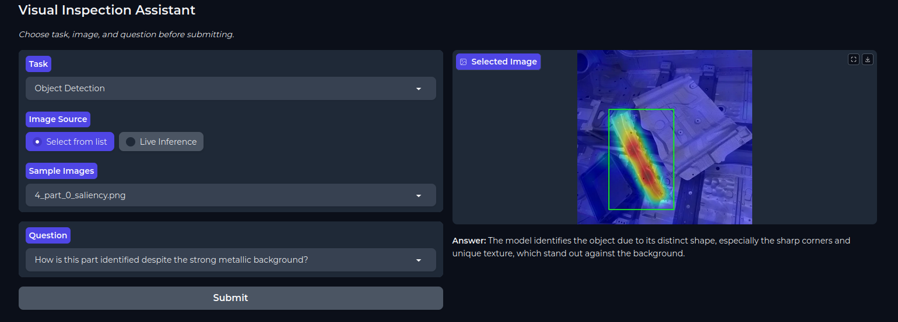

# InterLMM: Factory Visual Inspection Demo




This repository contains the implementation for our paper **“InterLMM: A Fine-tuned Large Vision-Language Model to Generate Human-Readable Explainable AI Results in the Industrial Domain”**, submitted to **CIRP ICME 2025**. It provides a simple Gradio notebook demo that lets non-technical users receive natural-language explanations of XAI visualizations generated by fine-tuned VLMs (Qwen2.5-7B-VL and Idefics3-8B).

---

## 📂 Repository Structure

```
Paper_implementation/
├── demo.ipynb                # Notebook with the Gradio interface
├── app.py                    # Standalone Gradio demo script
├── requirements.txt          # Python dependencies
├── qwen/                     # Qwen2.5-7B adapter files
│   ├── adapter_config.json
│   ├── adapter_model.safetensors
│   ├── added_tokens.json
│   ├── merges.txt
│   ├── special_tokens_map.json
│   ├── tokenizer_config.json
│   ├── tokenizer.json
│   ├── training_args.bin
│   └── vocab.json
└── idefics/                  # Idefics3-8B adapter files
    └── (same structure as qwen/)
```

---

## 🚀 Demo Overview

The demo lets you:
1. **Select Task**  
   - Object Detection or Classification  
2. **Choose Image Source**  
   - From a predefined folder or upload via webcam  
3. **Pick or Enter a Question**  
   - Predefined prompts or custom question  
4. **Submit & Receive**  
   - A concise, 10–20-word explanation of the saliency map for factory parts  

All backend inference is handled by fine-tuned Qwen2.5-7B-VL and Idefics3-8B models, targeting projection modules such as (`q_proj`, `k_proj`, `v_proj`). Both adapters were trained on a custom, synthetically augmented dataset and showed improved performance on our benchmarking suite.

---

## ⚙️ Requirements

Create a Python ≥ 3.8 environment and install:

```bash
pip install -r requirements.txt
```

---

## 📥 Installation & Setup

1. **Clone this repo**  
   ```bash
   git clone https://github.com/freddyfernandes/Finetuned_VLM_assistant.git
   cd Finetuned_VLM_assistant/Paper_implementation
   ```

2. **Install dependencies**  
   ```bash
   python -m venv venv
   source venv/bin/activate         # Linux/macOS
   # or `.env\Scriptsctivate`   # Windows
   pip install -r requirements.txt
   ```

3. **Download base models**  
   ```python
   # In Python REPL or a script:
   from transformers import Qwen2_5_VLForConditionalGeneration, AutoProcessor
   Qwen2_5_VLForConditionalGeneration.from_pretrained("Qwen/Qwen2.5-VL-7B-Instruct")
   AutoProcessor.from_pretrained("Qwen/Qwen2.5-VL-7B-Instruct")
   ```
---
   ```python
   # Similarly for Idefics3
    from transformers import AutoProcessor, AutoModelForImageTextToText
    processor = AutoProcessor.from_pretrained("HuggingFaceM4/Idefics3-8B-Llama3")
    model = AutoModelForImageTextToText.from_pretrained("HuggingFaceM4/Idefics3-8B-Llama3")
   ```
---

## 🔧 Customization

- **INPUT_DIR**  
  Change the path in the notebook to point to your own saliency-map images.  
- **ADAPTER_PATH**  
  Ensure `ADAPTER_PATH` matches the `qwen/` or `idefics/` folder name.  
- **Tasks & Prompts**  
  Edit `TASKS` and `PREDEF_QS` to add or modify questions.

---

## 📞 Contact

For questions, issues, or contributions, please reach out to   
Freddy Fernandes • 📧 freddyfernandesuni@gmail.com

---

**Enjoy exploring human-level XAI explanations with this simple demo!**